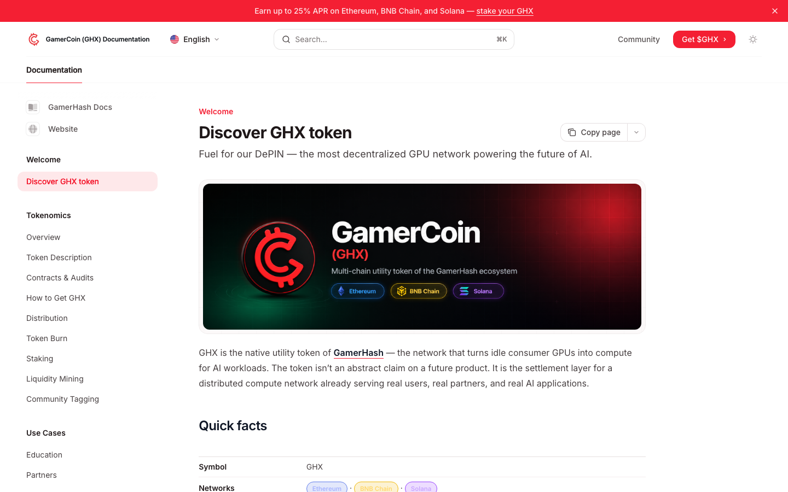

# GamerCoin (GHX) Documentation

Source for the official GamerCoin documentation site — token description, contracts, distribution, staking, liquidity mining, and burn schedule for GHX, the utility token of the GamerHash ecosystem.



Built with [Mintlify](https://mintlify.com). Multilingual: English (root), Polish (`pl/`), Korean (`ko/`).

## What's in here

| Section | What it covers |
| --- | --- |
| `tokenomics/` | Overview, token description, contracts, how to get GHX, distribution, burn, staking, liquidity mining, community tagging |
| `use-cases/` | Education, partner integrations |
| `resources/` | Glossary, how to track GHX |
| `tutorials/` | Step-by-step guides |
| `legal/` | Terms, disclaimers, regulatory notes |
| `roadmap.mdx` | Token-side roadmap |

Companion repo: [gamerhash-docs](https://github.com/rektor-jg/gamerhash-docs) — product / AI App / deAPI documentation.

## Local development

Install the Mintlify CLI and run the dev server from the repo root:

```bash
npm i -g mint
mint dev
```

The site will be served at `http://localhost:3000`.

## Structure

```
.
├── docs.json            # Mintlify config — navigation, theme, languages
├── index.mdx            # English landing page
├── pl/                  # Polish mirror — every EN page has a PL counterpart
├── ko/                  # Korean mirror — every EN page has a KO counterpart
├── tokenomics/          # See table above
├── use-cases/
├── resources/
├── tutorials/
├── legal/
├── images/              # Diagrams, hero art, charts
├── logo/                # Brand logos
└── snippets/            # Reusable MDX components (chain badges, etc.)
```

## About GHX

- **Symbol:** GHX
- **Networks:** Ethereum, BNB Chain, Solana
- **TGE:** 31 December 2020
- **Whitepaper:** Registered with the Malta Financial Services Authority (MFSA)

GHX is the utility token of the [GamerHash](https://gamerhash.com) network — a DePIN turning idle consumer GPUs into compute for AI workloads. See `tokenomics/` for the full picture.

## Contributing

- Every content change in EN must land in `pl/` and `ko/` in the same PR — keep facts identical, translate naturally.
- Image alt text should be translated, not copied from EN.
- New navigation entries belong in `docs.json` under each language block.
- Numeric facts (supply, burn, APR ranges) should match `tokenomics/` and not drift between language files.

## License

Content © GamerCoin / GamerHash. See `legal/` for terms.
