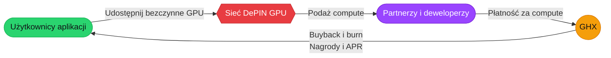

import { Eth, Bsc, Sol } from '/snippets/chains.mdx'

<Frame>
  
</Frame>

GHX to natywny token użytkowy [GamerHash](https://gamerhash.com) — sieci, która zamienia bezczynne, konsumenckie GPU w moc obliczeniową dla AI. Token nie jest abstrakcyjnym roszczeniem do przyszłego produktu. To warstwa rozliczeniowa rozproszonej sieci compute, która już teraz obsługuje realnych użytkowników, partnerów i aplikacje AI.

## Najważniejsze fakty

| | |
| --- | --- |
| **Symbol** | GHX |
| **Sieci** | <Eth /> · <Bsc /> · <Sol /> |
| **TGE** | 31 grudnia 2020 |
| **Mining** | Zakończony 31 stycznia 2026 — platforma działa teraz wyłącznie na compute dla AI |
| **deAPI** | Publiczne API sieci GPU GamerHash, ponad 6 000 zarejestrowanych developerów |
| **Whitepaper** | Zarejestrowany w Malta Financial Services Authority (MFSA) |

## Jak działa ekonomia GHX

Użytkownicy udostępniają moc GPU. DePIN agreguje ją i kieruje do zadań AI. Partnerzy i deweloperzy płacą za compute. Część przychodów jest używana do skupowania GHX z otwartego rynku i palenia tokenów; reszta trafia do kontrybutorów. Pętla wzmacnia się wraz z dołączaniem kolejnych partnerów.

## Co możesz robić z GHX

<CardGroup cols={2}>
  <Card title="Staking" icon="lock" href="/pl/tokenomics/staking">
    Zablokuj GHX na Ethereum, BNB Chain lub Solana. Do **25% APR**.
  </Card>
  <Card title="Dostarcz płynność" icon="droplet" href="/pl/tokenomics/liquidity-mining">
    LP na PancakeSwap — opłaty z transakcji plus nagrody w GHX.
  </Card>
  <Card title="Wydaj w aplikacji" icon="cart-shopping" href="https://gamerhash.com/en/shop">
    Gry, gift cards, vouchery w GamerHash Store.
  </Card>
  <Card title="Zarabiaj udostępniając GPU" icon="microchip" href="https://gamerhash.com/pl/app-download">
    Uruchom GamerHash AI App i otrzymuj GHX za udostępniony compute.
  </Card>
</CardGroup>

## Zacznij tutaj

<CardGroup cols={2}>
  <Card title="Opis tokena" icon="circle-info" href="/pl/tokenomics/token-description">
    Symbol, sieci, podaż i kluczowe zastosowania.
  </Card>
  <Card title="Jak zdobyć GHX" icon="arrow-right-arrow-left" href="/pl/tokenomics/how-to-get">
    Giełdy CEX, DEX i nagrody w platformie.
  </Card>
  <Card title="Kontrakty i audyty" icon="shield-check" href="/pl/tokenomics/contracts">
    Kanoniczne adresy, decimals i bridge'e.
  </Card>
  <Card title="Tutorial: jak stakować" icon="lock" href="/tutorials/how-to-stake-ghx">
    Pełny walkthrough dla nowych stakerów (EN).
  </Card>
</CardGroup>

## Partnerzy i integracje

GHX i sieć GPU GamerHash są zintegrowane z dostawcami infrastruktury, builderami AI i protokołami Web3, w tym:

[Aethir](https://aethir.com) · [BNB Chain](https://www.bnbchain.org) · [Celer Network](https://celer.network) · [Chainlink](https://chain.link) · [Exabits](https://exabits.ai) · [IQNet](https://iqnet.io) · [PAAL AI](https://paalai.ai) · [The Sandbox](https://www.sandbox.game)

Realne produkty działające na sieci: **HUMAIN** (produkt konsumencki na żywo) i **GenTok** (treści AI dla społeczności Web3). Platforma [deAPI](https://deapi.ai) udostępnia ten sam rozproszony compute każdemu deweloperowi przez API kompatybilne z OpenAI i jest teraz oficjalnym węzłem w n8n.

## Najnowsze aktualizacje

Zespół publikuje miesięczne community updates i dłuższe artykuły na [Medium](https://medium.com/we-are-the-gamerhash). Wybrane:

<CardGroup cols={2}>
  <Card title="Why $GHX isn't just another token" icon="newspaper" href="https://medium.com/we-are-the-gamerhash/why-ghx-isnt-just-another-token-1ce77aa720e4">
    Tokenomia oparta na infrastrukturze — luty 2026.
  </Card>
  <Card title="From Mining to AI: GamerHash Evolution" icon="arrow-trend-up" href="https://medium.com/we-are-the-gamerhash/from-mining-to-ai-the-gamerhash-evolution-75bf96424530">
    Pivot z PoW mining do rozproszonego compute dla AI — luty 2026.
  </Card>
  <Card title="Community Update — March 2026" icon="calendar" href="https://medium.com/we-are-the-gamerhash/gamerhash-community-update-march-2026-806305418c1a">
    Generowanie wideo LTX-2.3; deAPI jako n8n node.
  </Card>
  <Card title="Wszystkie aktualizacje na Medium" icon="rss" href="https://medium.com/we-are-the-gamerhash">
    Pełne archiwum publikacji.
  </Card>
</CardGroup>

## Zakres dokumentacji

- **Tokenomia** — podaż, dystrybucja, burn, staking, programy płynnościowe, kontrakty.
- **Zastosowania** — integracje partnerskie i programy edukacyjne wykorzystujące GHX.
- **Tutoriale** — przewodniki end-to-end dla najczęstszych operacji.
- **Roadmapa** — co dostarczyliśmy i co dalej.
- **Zasoby** — live data, glossary, przydatne linki.
- **Informacje prawne** — whitepaper, polityka AML/CFT, disclaimer.

Dokumentacja platformy GamerHash (aplikacje, AI, miner technology) znajduje się w [GamerHash docs](https://docs.gamerhash.com).
