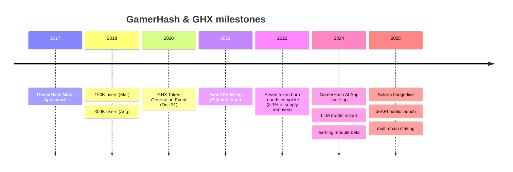

The roadmap is delivery-driven. Items are tracked by quarter and marked when shipped.

## Timeline

## Browse

<CardGroup cols={2}>
  <Card title="Journey so far" icon="clock-rotate-left" href="/roadmap/journey-so-far">
    From 2017 mining app to today's AI platform.
  </Card>
  <Card title="2024 highlights" icon="check" href="/roadmap/2024-highlights">
    AI app development and platform scale.
  </Card>
  <Card title="2025 plan" icon="rocket" href="/roadmap/whats-next-2025">
    Active and shipped quarters for 2025.
  </Card>
  <Card title="Future goals" icon="binoculars" href="/roadmap/future-goals">
    Long-term direction.
  </Card>
</CardGroup>
