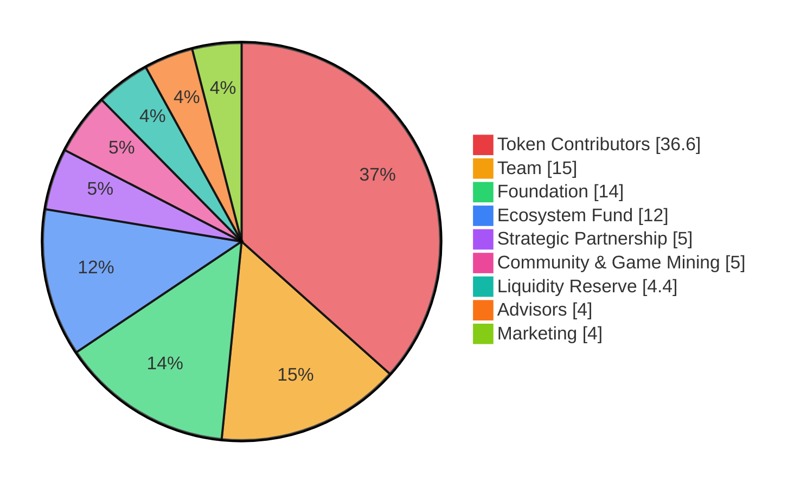

The Token Generation Event (TGE) took place on **31 December 2020**. Between December 2021 and June 2022, seven rounds of token burns reduced the supply by **8.1%** (72,000,000 GHX). See [Token Burn](/tokenomics/burn) for details.

## TGE allocation

| Bucket | Share | Purpose |
| --- | --- | --- |
| Token Contributors | 36.6% | Private and seed sale buyers (with bonus tokens vested) |
| Team | 15.0% | Core team incentive pool |
| Foundation | 14.0% | Industry support: developers, organizations, events |
| Ecosystem Fund | 12.0% | Partner integrations and Play&Earn rewards |
| Strategic Partnership | 5.0% | Long-term integrators (not for secondary markets) |
| Community & Game Mining | 5.0% | Community rewards and mining bonuses |
| Liquidity Reserve | 4.4% | DEX/CEX market-making liquidity |
| Advisors | 4.0% | Strategic advisor allocation |
| Marketing | 4.0% | User acquisition, brand, conferences |

## Vesting schedule

```mermaid
gantt
    title GHX vesting timeline (months from TGE)
    dateFormat X
    axisFormat %s
    section Seed & Private
    Vesting :0, 9
    section Liquidity Reserve
    Instant :0, 1
    section Community & Game Mining
    Cliff :crit, 0, 1
    Vesting :1, 33
    section Advisors
    Cliff :crit, 0, 3
    Vesting :3, 12
    section Marketing
    Cliff :crit, 0, 3
    Vesting :3, 12
    section Ecosystem Fund
    Cliff :crit, 0, 1
    Vesting :1, 60
    section Team
    Cliff :crit, 0, 12
    Vesting :12, 30
    section Foundation
    Cliff :crit, 0, 12
    Vesting :12, 48
    section Strategic Partnership
    Cliff :crit, 0, 24
    Vesting :24, 36
```

| Bucket | Cliff | Schedule | Total duration |
| --- | --- | --- | --- |
| Seed & Private sale | None | 12.5% at TGE+7d, 12.5% at TGE+14d, 25% every 3 months | 9 months |
| Team | 12 months | 10% at start, 5% monthly for 18 months | 30 months |
| Foundation | 12 months | 25% at start, 25% every 12 months for 3 years | 4 years |
| Ecosystem Fund | 30 days | 10% at start, 18% every 12 months for 5 years | 5 years |
| Strategic Partnership | 24 months | 50% at year 2, 50% at year 3 | 3 years |
| Community & Game Mining | 30 days | 4% at start, 3% monthly for 32 months | 33 months |
| Advisors | 90 days | 25% at start, 25% every 3 months | 12 months |
| Marketing | 90 days | 25% at start, 25% every 3 months | 12 months |
| Liquidity Reserve | None | Instant | — |

<Note>
Distribution figures reflect the original TGE allocation. Current circulating supply differs due to vesting unlocks and the seven burn rounds.
</Note>
