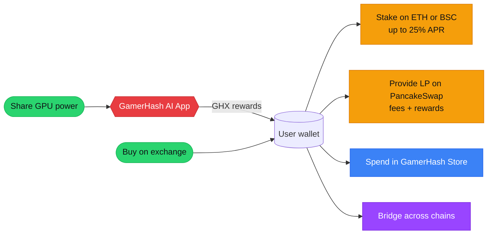

import { Eth, Bsc, Sol } from '/snippets/chains.mdx'

GHX is a multi-chain utility token. It powers transactions, rewards, and access to services across the GamerHash platform.

## Token flow

## Networks

GHX is deployed on three chains. Liquidity is bridged across all three.

| Chain | Standard | Contract |
| --- | --- | --- |
| <Eth /> | ERC-20 | `0x728f30fa2f100742c7949d1961804fa8e0b1387d` |
| <Bsc /> | BEP-20 | `0xbd7b8e4de08d9b01938f7ff2058f110ee1e0e8d4` |
| <Sol /> | SPL | `Cy52Ts2GwSzdkhCihB5i1Vu6sApzgqktNNFyHbsdgwm7` |

## Utility

| Function | Description |
| --- | --- |
| Payments | Used inside the GamerHash Store and across GamerHash AI services |
| GPU compute rewards | Distributed to users who share GPU power via the GamerHash AI App |
| Staking | Locked on Ethereum or BSC for APR rewards |
| Liquidity mining | LP positions on PancakeSwap (BSC) earn additional GHX |
| Access | Required for certain in-app features (e.g. AI Image Booster prompts) |

## Where to next

<CardGroup cols={2}>
  <Card title="Token Description" icon="circle-info" href="/tokenomics/token-description">
    Detailed breakdown of each utility.
  </Card>
  <Card title="How to Get GHX" icon="cart-shopping" href="/tokenomics/how-to-get">
    CEX, DEX, and platform earnings.
  </Card>
  <Card title="Distribution" icon="chart-pie" href="/tokenomics/distribution">
    TGE allocation and vesting.
  </Card>
  <Card title="Staking" icon="lock" href="/tokenomics/staking">
    APRs by network and lock period.
  </Card>
</CardGroup>
